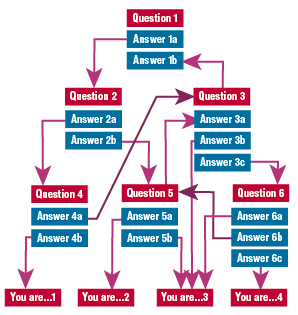
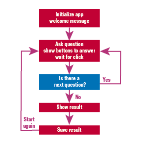
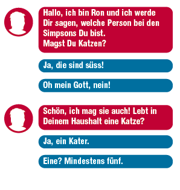

Maybe the project is called "DECIDE!"
==============

Short description of the project (3-5 sentences)
--------------
Tamedia runs a net of news-Websites. Especially young people should be attracted with interactive an egocentric content. Therefore I'm goning to programm a tool that they can use to position and classify themselves. Questions could be: Where shall I spend my holidays? What character am I in the nativity play? Which politician should I vote for?




Key functionality (not more than 5 points)
--------------
- the tool asks a question an offers a number of answers (to click)
- according to the answer another question is asked and another couple of answers is given
- at the end the tool classifies the user
- the user can share his result with social media
- the tool can easily be user with other dataset




Write down the most important functionality
--------------
- the project should be programmed in react
- the look is simple, similar to a chatbot
- the user shall be adressed personally e.g. "Hi, I'm ron and I'll tell you what character of the Simpsons you are."
- the avatar can be changed for each project
- question and answers are stored in a json-file (easy to maintain, no changes are needed)
- for each question a picture can also be shown
- infrastructure must be rented (e.g. Heroku, Elephant)
- the tool will be iframed on Tamedia news websites
- *the final result of each user is stored in an sql database
- *the tool shows, what result the others came to, Barchart (e.g. 73% are Bart Simpson)
- *the projects are collected and stored on a website (e.g. managed by Wordpress)
*maybe later




Structure of the question-and-answer-json
```javascript
data = [
  questions {
    question1: {
      'Do you like cats?'
      answers: {
        'Oh my gosh, NO!: then go to question7',
        'They\'re cute!: then go to question3',
        'With barbecued sauce?: go to restult2'
        }
      image-src: 'cat.jpg'
    }
    question2 {answers..., img-src}
    question... {answers..., img-src}
  }
  results {
    result1: {
      'You are....'
      img-src
    }
    result2: {
      'You are....'
      img-src
    }
  }
]
```